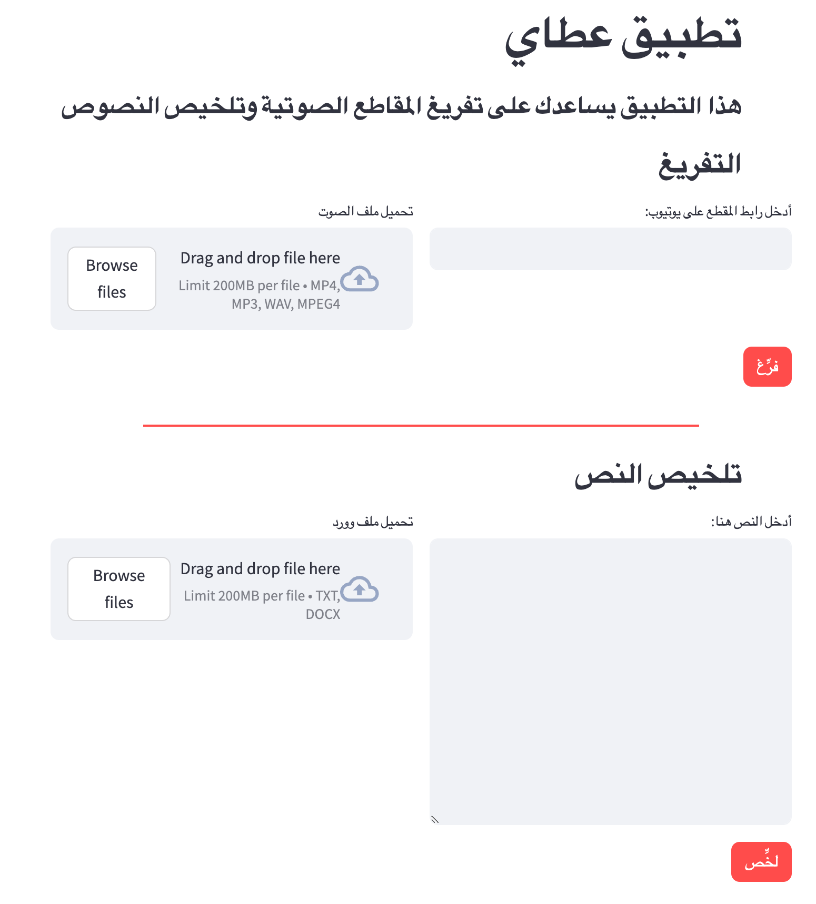

# AtaAI-dev
رفيقك في طلب العلم

تثبيت الحزم
```bash
pip install -r requirements.txt
```
تشغيل التطبيق
```bash
streamlit run app.py
```

### تشغيل التطبيق من خلال docker
صُنع docker

```bash
docker build -t ataai-app .
```
تشغيل docker
```bash
docker run -p 8501:8501 --env-file .env ataai-app
```
### واجهة التطبيق


